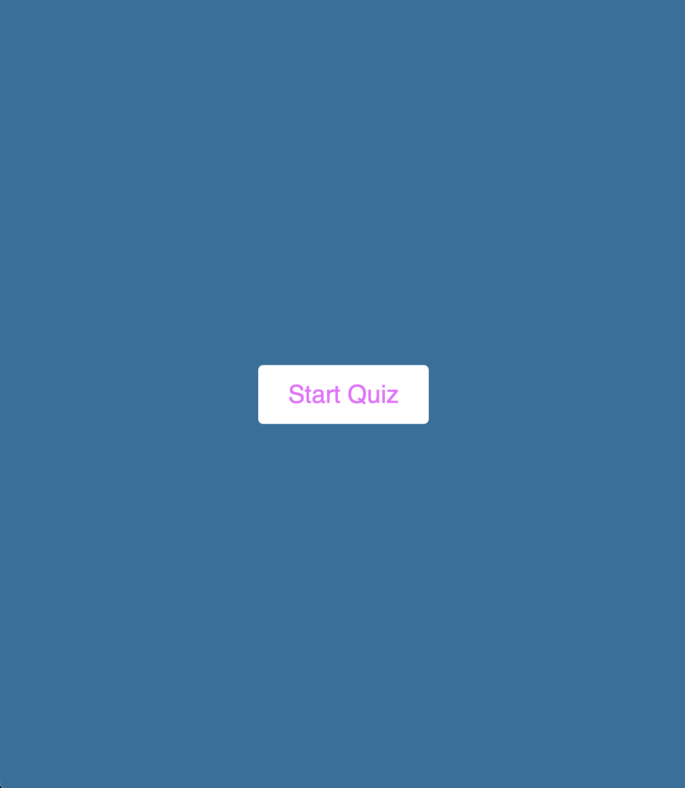
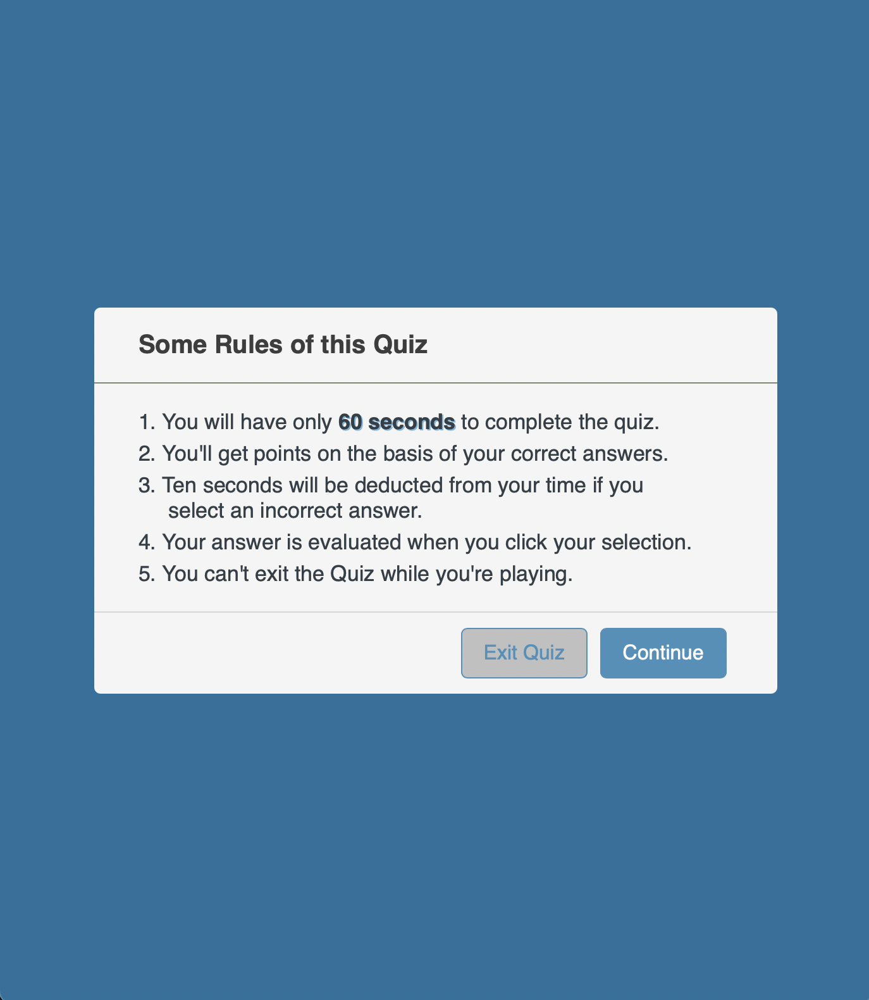

# JavascriptCodeQuiz

## Description

Application quizzes the user on JavaScript code knowledge. This timed quiz gives 60 seconds to complete 5 questions about JavaScript code fundamentals. High scores can be entered to track user progress and compare to their peers.

## Features

This app features dynamically updated HTML and CSS and is powered by JavaScript. It has a clean, polished and responsive user interface.

## Bug Fix Road Map

Timer stops when user selects first answer. High scores feature is currently unavailable. Question counter not styled. Result Box not enabled.

### Visuals

